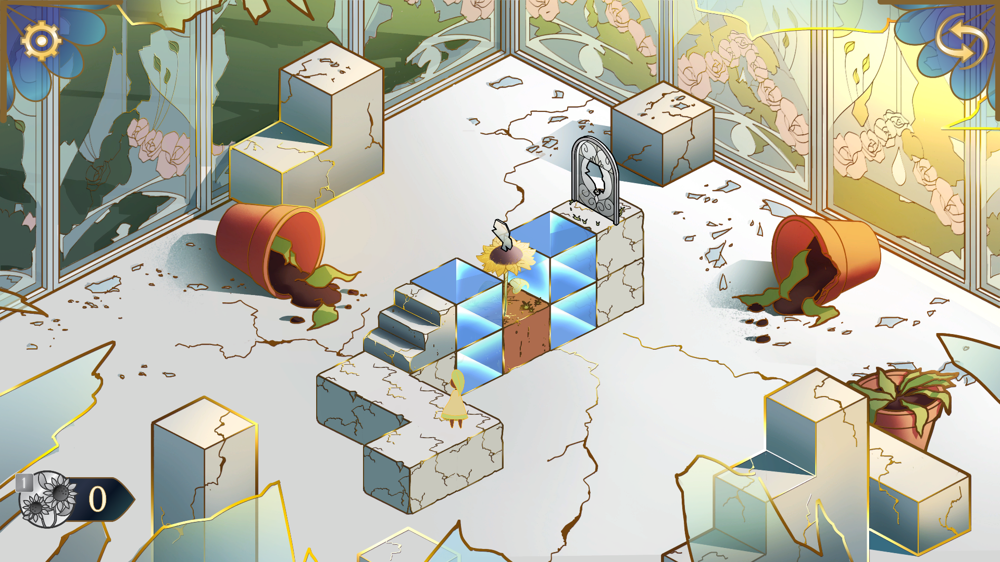
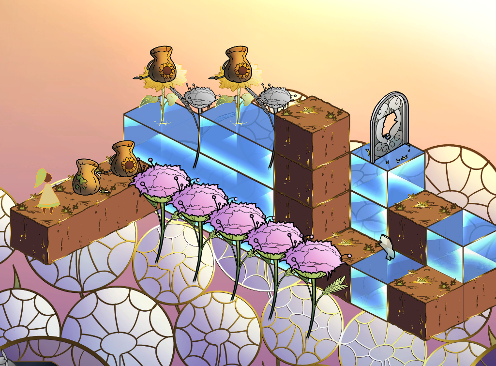

Shards Between Us is an isometric game made entirely with 2D assets. With the art inspired by Art Nouveau and stained glass, I wanted to show metallic line art.

The game is being developed in Unity, and I used ShaderGraph for this shader.

## Demo

## Details

I exposed the shine color, angle, and speed. I also exposed the drop shadow color, its distance, and the line art color.

The shader uses a normal map for 2D lighting and a separate line art map. I WANT TO COMBINE THE NORMAL MAP AND THE LINE ART MAP TO ONLY HAVE ONE EXTRA TEXTURE. The normal map's alpha channel contains the line art alpha.

but we didn't have any dynamic lighting. 
used painted sprites with no dynamic lighting.

## The Problem

The first pass of our game had all of the art as sprites with no shaders. I wanted the line art to look like gold, so I baked in the metallic shine into the sprite. Unfortunately, this made the level difficult to read. When we started on the second pass of Shards, I wanted to update the art to be more flexible and dynamic. I added normal maps to the tiles and, more importantly, started working on a line art shader.

## The Solution

When we started development on Shards Between Us, I started looking into how I could implement a shine across the line art. I quickly stumbled into the world of shaders, and I watched YouTube tutorials and scoured the Unity ShaderGraph documentation as I experimented in-engine. I ended up with a shader that takes a sprite's line art, colors it gold, and adds a subtle drop shader under the line art. I originally added a shine across the entire screen's line art, but we decided to limit the shine to interactable objects. I wrote a short script to randomly get a TIME INTERVAL (OR START TIME OR SOMETHING) and attached it to the shader so each object shines at different times.

## Getting Started

[Getting Started]({{ site.github.url }}): getting started with installing Millennial, whether you are completely new to using Jekyll, or simply just migrating to a new Jekyll theme.

## Example Content

[Text and Formatting]({{ site.github.url }})
